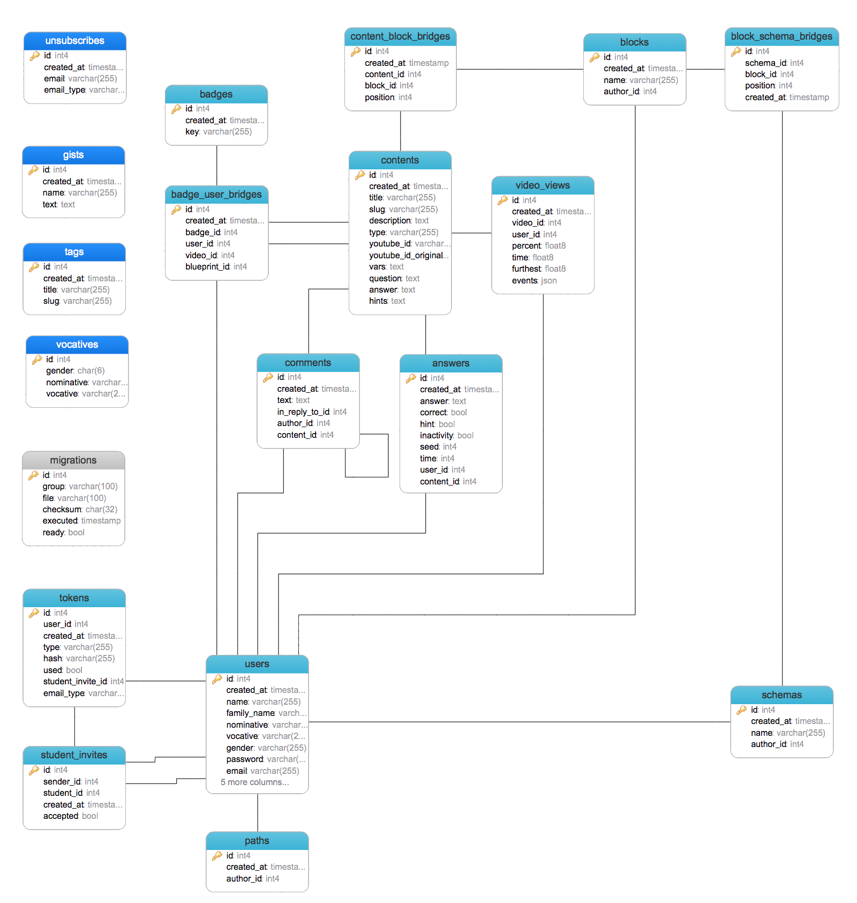

Khanova škola – verze 3
=======================

[](https://travis-ci.org/KhanovaSkola/khanovaskola-v3)
[](https://www.versioneye.com/user/projects/53bab754609ff013b300020b)

License
-------

MIT License, see [LICENSE.md](LICENSE.md)

Link directory
--------------

<dl>
	<dt>http server</dt>
		<dd>http://vagrant.khanovaskola.cz/</dd>
	<dt>adminer</dt>
		<dd>http://vagrant.khanovaskola.cz/tools/db/</dd>
	<dt>mail trap</dt>
		<dd>https://mailtrap.io/inboxes/23883/messages</dd>
	<dt>elasticsearch console</dt>
		<dd>http://www.elastichq.org/app/index.php?url=http://vagrant.khanovaskola.cz:9200</dd>
	<dt>beanstalkd console</dt>
		<dd>http://vagrant.khanovaskola.cz/tools/beanstalk/public/</dd>
	<dt>opcache dashboard</dt>
		<dd>http://vagrant.khanovaskola.cz/tools/opcache/</dd>
</dl>

Requirements
------------

*Server:*

- php 5.5
- postgres
- redis
- elasticsearch 1.2.
- elasticsearch/elasticsearch-analysis-icu/2.2.0
- beanstalkd


*Dev / tests:*

- phantomjs
- casperjs
- nodejs
- grunt

Setup
-----

install git hooks:
```sh
sh bin/install-hooks
```

Data Model
----------




Info
----

Commit tags:

- `[test]`
- `[cs]` Coding standard, code smell removal, whitespace, etc. Should not affect build.
- `[dev]` Vagrant setup, dev stack edits, etc. Should not affect build.

skip codesniffer `pre-commit` hook
```sh
git commit --no-verify
```

run unit tests:
```sh
php vendor/bin/tester -c /etc/php5/cgi/php.ini tests/unit/
```

run acceptance tests with debug on:
```sh
casperjs test --config=tests/cept/config.json --log-level=debug --includes=tests/cept/bootstrap.js tests/cept/cases --verbose
```

run coding style (cs) tests:
```sh
sh tests/cs/run.sh
```

create new migration from template:
```sh
php bin/console db:create whatAmIChanging
```

drop all data, recreate schemas and indices:
```sh
bin/console db:reset && bin/console neo:reset && bin/console db:migrate && bin/console es:recreate && bin/console db:fill
```

run migrations:
```sh
php bin/console db:migrate
```

recreate elasticsearch indices from config file:
```sh
php bin/console db:es recreate
```

build frontend:
```sh
gulp
```
