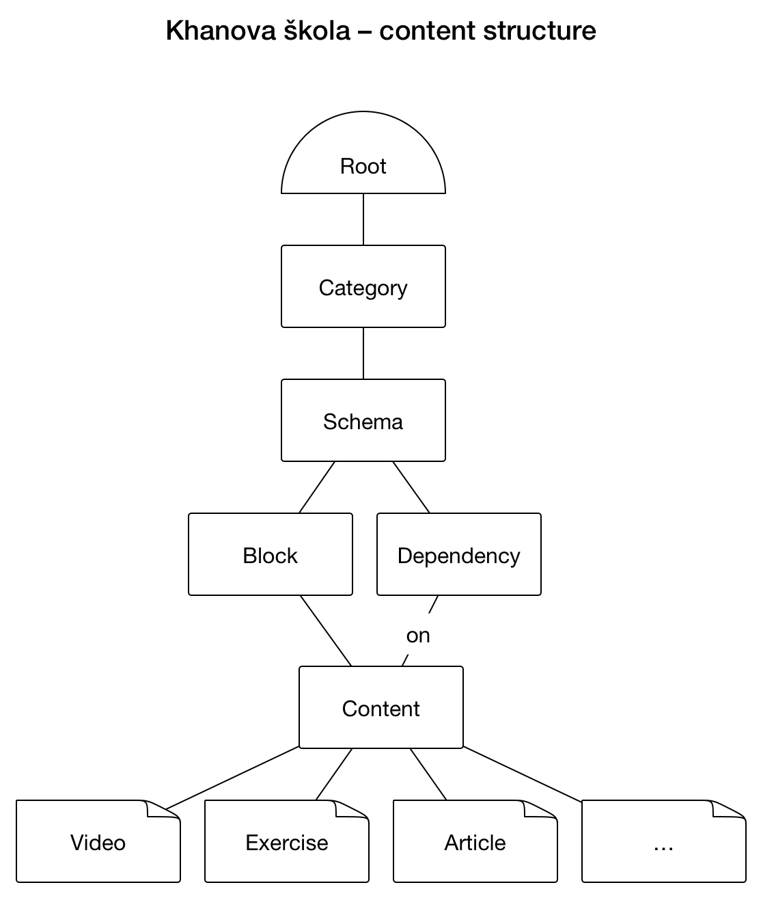

Khanova škola – verze 3
=======================

License
-------

MIT License, see [LICENSE.md](LICENSE.md)

Link directory
--------------

<dl>
	<dt>adminer</dt>
		<dd>/tools/db/</dd>
	<dt>mail trap</dt>
		<dd>https://mailtrap.io/inboxes/23883/messages</dd>
	<dt>elasticsearch console</dt>
		<dd>http://www.elastichq.org/app/index.php?url=http://localhost:9200</dd>
	<dt>beanstalkd console</dt>
		<dd>http://vagrant.khanovaskola.cz/tools/beanstalk/public/</dd>
	<dt>opcache dashboard</dt>
		<dd>/tools/opcache/</dd>
</dl>

Documentation
-------------

See [doc/readme.md](doc/readme.md).

Requirements
------------

All required dependencies are avaiable for both both Unix and Windows OSes.

*Server:*

- php 5.6 (tested with 7.0 as well)
- postgres 9.3.5
- elasticsearch 1.2
- elasticsearch/elasticsearch-analysis-icu/2.2.0
- rabbitmq
- bc
- redis (optional)


*Dev / tests:*

- phantomjs
- casperjs
- nodejs
- gulp

Installation
------------
See [INSTALL.md](INSTALL.md)

Setup
-----
(maybe obsolete)
install git hooks:
```sh
sh bin/install-hooks
```

Encrypted files
---------------

https://github.com/StackExchange/blackbox

Following files are GPG crypted: [blackbox files](keyrings/live/blackbox-files.txt)

Following developers can decrypt those files: [blackbox admins](keyrings/live/blackbox-admins.txt)

Data Model
----------



Info
----

Commit tags:

- `[test]`
- `[cs]` Coding standard, code smell removal, whitespace, etc. Should not affect build.
- `[dev]` Vagrant setup, dev stack edits, etc. Should not affect build.

skip codesniffer `pre-commit` hook
```sh
git commit --no-verify
```

run unit tests:
```sh
php vendor/bin/tester -c /etc/php5/fpm/php.ini tests/unit/ -p php
```

run acceptance tests with debug on:
```sh
casperjs test --config=tests/cept/config.json --log-level=debug --includes=tests/cept/bootstrap.js tests/cept/cases --verbose
```

invoke console:
```sh
php www/index.php
```

create new migration from template:
```sh
php www/index.php scaffolding:migration:sql note-what-are-you-changing
```

recreate elasticsearch mappings and repopulate
```sh
php www/index.php es:recreate && php www/index.php es:populate
```

run migrations:
```sh
php www/index.php migrations:migrate
```

build frontend:
```sh
gulp production
```

